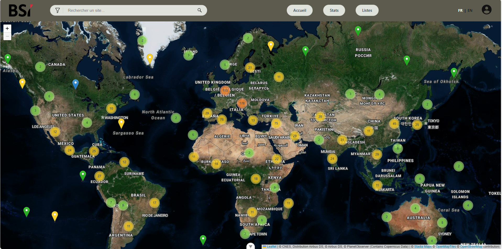
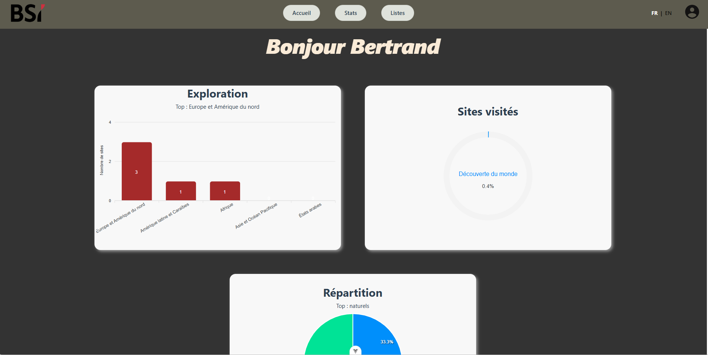
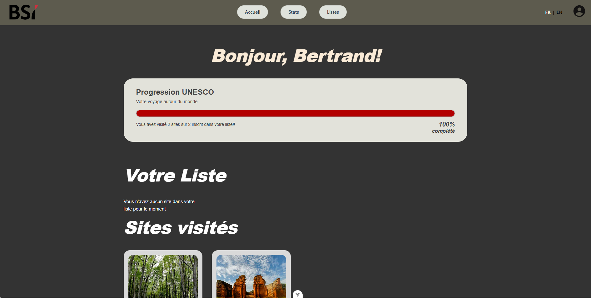
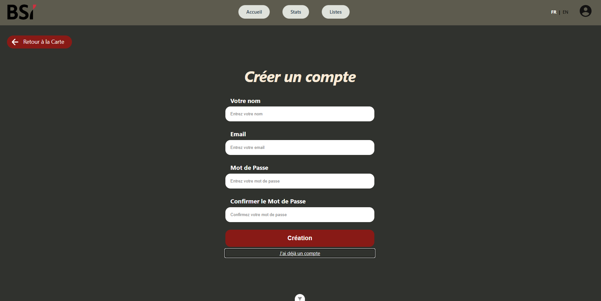
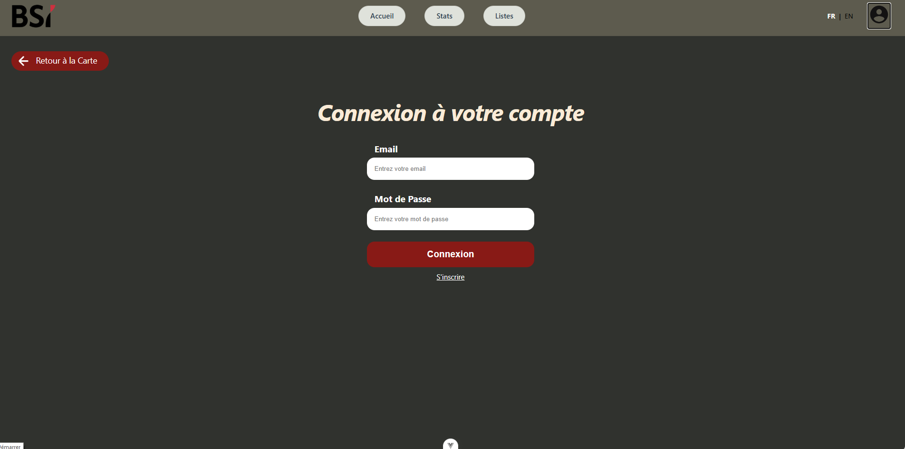

# I426-SCRUM

## Description

> Au cours de ce projet, une équipe de développeurs à été amenée à tester et travailler à l'aide de la méthodologie de travail _SCRUM_.
> En effet, cette équipe a pu rencontrer un client et se mettre en condition de travail comme en entreprise (ou presque). Le but était de développer une application web entière dans une équipe de 7 (puis 6 par la suite).
>
> L'application est vouée à l'UNESCO, en effet son but est d'afficher une carte du monde ainsi que les sites de l'UNESCO dessus. L'utilisateur pourra alors se balader sur la carte du site et consulter les sites de l'UNESCO afin de trouver plus d'infos dessus, comme par exemple le nom, une description, les pays impliqués, des images, et bien d'autres...  
> L'utilisateur a la possibilité de créer un compte ainsi que de s'y connecter afin d'ensuite pouvoir ajouter des sites de la carte à ses listes _liste de souhaits_ et _liste des sites visités_. L'utilisateur pourra ensuite consulter ses statistiques sur une autre page du site dédiée.
>
> L'équipe avait donc 4 mois à raison de 3 heures par semaine (l'équivalent de 4 périodes par semaine) pour terminer cette application et la présenter au client. Au cours de ces 4 mois, 3 sprints ont été terminés et ainsi 3 présentations de l'application ont été réalisées auprès du client.

## Technologies

> - HTML
> - CSS
> - JS
> - VueJS
> - AdonisJS

## Installation

> Afin d'installer le projet, veuillez commencer par télécharger le projet disponible sur Github (archive tar ou le zip, il est aussi possible de faire un fork puis un clone du repo).
>
> Avant toutes choses, veuillez copier le fichier .env.example, le coller au même endroit et le renommer ".env".
> Après avoir fait cela, rendez vous dans le dossier _My Unesco Exploration_, et ouvrez une ligne de commande.  
> Dans cette ligne de commande, veuillez écrire la commande `npm i`, cette commande va installer toutes les dépendances utilisées lors de ce projet.
>
> Pendant ce temps, vous pouvez vous rendre dans le dossier _./db_ et ouvrir une autre console afin d'y lancer la commande `docker compose up -d`.
>
> Maintenant que tout est installé, vous pouvez faire un `npm audit fix` pour vous assurer qu'il n'y a aucun problème a ce niveau, cette commande va examiner les dépendances installées et va rechercher des vulnérabilité de sécurité, si elle en trouve, la commande va automatiquement créer installer les mises à jour disponibles et corriger ces vulnérabilités.  
> Ensuite, ouvrez une ligne de commande bash dans ce même dossier et écrivez cette commande `node ace generate:key`, cette commande va générer une clé qui doit rester secrète, ne l'affichez pas dans le .env.example, ç'est dangereux, cette clé sera générée et ajoutée au fichier .env avec le nom de constante "APP_KEY".  
> Il faudra aussi lancer la commande `node ace migration:fresh --seed`
> Dès que vous êtes certain qu'il n'y a aucun problème avec les dépendances, vous pouvez utiliser la commande `npm run dev`, cette commande va vous renvoyer l'adresse du site, vous n'aurez plus qu'à copier/coller ce lien dans votre navigateur et vous vous retrouverez sur la page d'accueil du site.

## Utilisation

> Concernant l'utilisation du site web, étant donné que le site n'est malheureursement pas publié, il faut le faire fonctionner en local. Pour cela, des instructions de fonctionnement ont été fournies au chapitre **Installation**.

## Illustrations

> Dans cette partie du rapport se trouve des images du site web dans son état au sprint 3.  
> Ces images illustrent les pages du site et possèdent une courte description.

### Page d'accueil

> Voici la page d'accueil du site, c'est sur cette page que tous les utilisateurs arriverons.  
> Sur cette page l'utilisateur peut voir la navigation avec les différentes pages auxquelles nous pouvons accéder depuis l'accueil, ce dernier peut aussi voir la carte du monde avec les points qui représentent les différents sites de l'UNESCO.

### Page de statistiques

> En image se trouve la page de statistique, cette dernière est uniquement accessible aux utilisateurs enregistrés.  
> Ici l'utilisateur peut consulter 3 données représentées sous forme de graphiques. Voici ce que décrivent ces 3 graphiques.
>
> - Le premier graphique mets en valeur le nombre de sites de l'UNESCO par continent ainsi que le continent possèdant le plus de sites visités.
> - Le pourcentage de sites visités par rapport à la totalité des sites dans le monde.
> - Le dernier graphique met en évidence la répartition des sites visités dans les 3 catégories suivantes : naturel, culturel et mixte.

### Page des listes

> En haut de la page, l'utilisateur pourra retrouver le nombre de site visités et/ou qui font partie de la liste avec un pourcentage des sites visité.  
> Ensuite, il y a la wishlist, avec les sites de l'UNESCO répertoriés par l'utilisateur, ainsi que la liste des sites qui figuraient dans la liste et qui sont désormais visités.

### Page de création de compte

> Sur cette page, l'utilisateur peut se créer un compte afin d'ensuite avoir accès aux autres fonctionnalités telles que l'édition des listes ainsi que la pages des statistiques.

### Page de login

> La page de login vient avec la page de création de compte. Cette dernière permet à l'utilisateur de se connecter à son compte respectif et ainsi accèder à ses ressources, comme par exemple ses listes de sites UNESCO sauvegardés.

## Conclusion

> En conclusion, l'équipe a utilisé plusieurs [technologies](#technologies) informatiques dans ce projet.
> Le site web dans son état final comporte trois pages principales:
>
> - [La page d'accueil](#page-daccueil)
> - [La page de statistiques](#page-de-statistiques)
> - [La page de Listes](#page-des-listes)
>
> Ainsi que 2 pages alternatives:
>
> - [La page de connexion](#page-de-login)
> - [La page d'inscription](#page-de-création-de-compte)
>
> Dans l'ensemble, les obejctifs fixés ont été remplis et la méthodologie SCRUM a bel et bien été appliquée au sein de l'équipe. De plus ce projet aura été un moyen pour l'équipe de progresser et gagner de l'expérience en travail de groupe.  
> Ce fut en effet la première fois que les participants se trouvèrent dans ces conditions.
